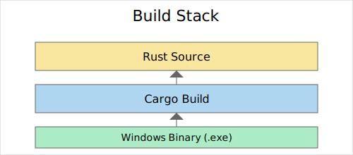
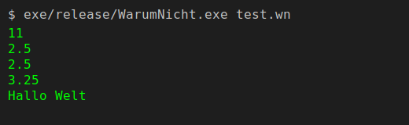

# WarumNicht


  

Ein kleines Experiment einer eigenen Programmiersprache. Das Repository enthaelt einen simplen Lexer, Parser und eine minimale Laufzeitumgebung in Rust.

## Inhaltsverzeichnis
- [Features](#features)
- [Schnellstart](#schnellstart)
- [Aus dem Quellcode bauen](#aus-dem-quellcode-bauen)
- [Stack-Überblick](#stack-Überblick)
- [Beispielausführung](#beispielausfuehrung)
- [Mitmachen](#mitmachen)
- [Rechtliches](#rechtliches)

## Features
- **Einfache Syntax** mit Ganzzahlen, Gleitkommazahlen und Strings
- **Mathematische Ausdrücke** inklusive Operator-Priorität
- **Interpreter** kompiliert Quelltext zur Laufzeit
- **Test-Suite** lässt sich mit `cargo test` starten

## Schnellstart
Eine vorgebaute Windows-Version liegt im Ordner `exe/release`. Um die mitgelieferte Beispieldatei auszuführen:

```bash
exe/release/WarumNicht.exe test.wn
```

In Zukunft soll dieser Schritt plattformunabhängig funktionieren.

## Aus dem Quellcode bauen
Um selbst zu kompilieren, benötigst du eine aktuelle Rust-Toolchain:

```bash
cargo build --release
```

Das fertige Binary findest du unter `target/release`. Die Tests startest du mit:

```bash
cargo test --quiet
```

## Stack-Überblick



Das Projekt besteht aus einem selbstgeschriebenen Lexer und Parser, einer kleinen Laufzeit sowie einem CLI-Frontend. Für Windows wird eine MinGW-Toolchain verwendet, um ein `.exe` zu erzeugen.

## Beispielausführung



Der Screenshot zeigt die aktuelle Ausgabe der Testdatei. Künftige Versionen sollen mehr Features enthalten und eventuell ein neues Interface bekommen.

## Mitmachen
- Pull Requests und Issues sind jederzeit willkommen.
- Lies bitte vorher den [Code of Conduct](CODE_OF_CONDUCT.md).

## Rechtliches
Siehe die [Terms of Service](TERMS_OF_SERVICE.md) für Haftungsausschluss und weitere Hinweise.
