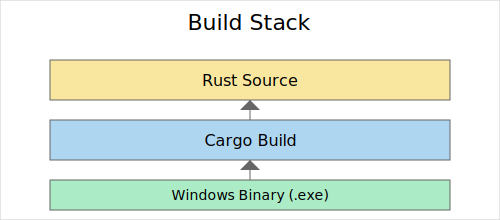

# WarumNicht


Ein kleines Experiment einer eigenen Programmiersprache. Im Repository findest du einen simplen Lexer, Parser und eine rudimentäre Laufzeitumgebung in Rust.


## Features

- **Einfache Syntax** mit Ganzzahlen, Gleitkommazahlen und Strings
- **Mathematische Ausdrücke** inklusive Operator-Priorität
- **Kompilierung zur Laufzeit** über den enthaltenen Interpreter

## Nutzung

Derzeit ist eine vorgebaute Windows-Version im Ordner `exe/release` enthalten. Eine Testdatei namens `test.wn` liegt im Repository. Du kannst sie wie folgt ausführen:

```bash
exe/release/WarumNicht.exe test.wn
```

Diese Aufrufform kann sich in Zukunft ändern.

## Bauen aus dem Quellcode

Zum Kompilieren wird eine aktuelle Rust-Toolchain benötigt:

```bash
cargo build --release
```

Das erzeugte Binary findest du anschließend im Ordner `target/release`.

## Stack



Das Projekt besteht größtenteils aus Rust-Code. Für Windows wird eine MinGW-Toolchain genutzt, um ein lauffähiges `.exe` zu erzeugen. Lexer, Parser und die kleine Laufzeitumgebung sind komplett selbst geschrieben.

## Beispielausführung


So sieht aktuell der Aufruf der mitgelieferten Testdatei aus. In Zukunft kann sich das Interface aber noch ändern.

## Mitmachen

Pull Requests und Issues sind willkommen! Bitte beachte dazu auch den [Code of Conduct](CODE_OF_CONDUCT.md).

## Rechtliches

Siehe die [Terms of Service](TERMS_OF_SERVICE.md) für Haftungsausschluss und weitere Hinweise.

